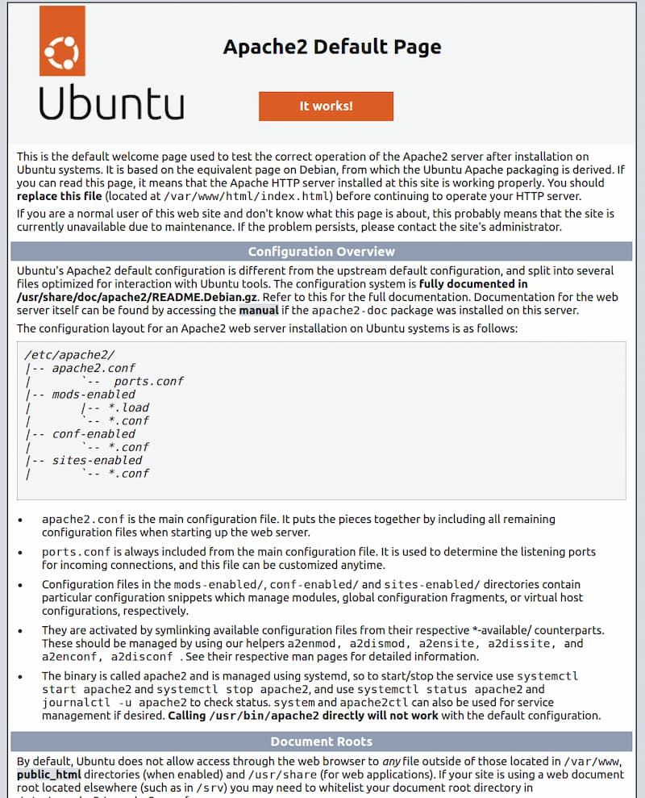

# Procédure d'installation d'un serveur web
La procédure contiendras toute les infos nécessaire pour avoir un serveur web apache, une base de données mysql, phpmyadmin sur un sous domaine différent, une hiérarchie efficance dans chaque sous domaine, ufw et fail2ban a des fin de sécurité, et un .htaccess pour les sous domaine sensible.

## Installer Apache et Mettre a jour le Firewall
Update la cache du package manager (pour assurer que les dernières version des logiciels soient installer par après)
```bash
sudo apt update
```

Par la suite installer apache2
```bash
sudo apt install -y apache2
```

Une fois l'installation terminée, vous devrez ajuster les paramètres de votre pare-feu pour autoriser le trafic HTTP. L'outil de configuration de pare-feu par défaut d'Ubuntu s'appelle Uncomplicated Firewall (UFW).
```bash
sudo ufw app list
```
**Output :**
```bash
Available applications:
  Apache
  Apache Full
  Apache Secure
  OpenSSH
```

Explication de chacun des profils
- Apache : Ce profil ouvre uniquement le port 80 (trafic web normal non chiffré).

- Apache Full : Ce profil ouvre à la fois le port 80 (trafic web normal non chiffré) et le port 443 (trafic chiffré TLS/SSL).

- Apache Secure : Ce profil ouvre uniquement le port 443 (trafic chiffré TLS/SSL).

Pour l’instant, il est préférable de n’autoriser que les connexions sur le port 80, puisque c'est une installation Apache fraîche et que vous n'avez pas encore configuré de certificat TLS/SSL pour autoriser le trafic HTTPS sur votre serveur.

Pour n'autoriser que le trafic sur le port 80, utilisez le profil Apache :
```bash
sudo ufw allow in "Apache"
```
**Output :**
```bash
Status: active

To                         Action      From
--                         ------      ----
OpenSSH                    ALLOW       Anywhere
Apache                     ALLOW       Anywhere
OpenSSH (v6)               ALLOW       Anywhere (v6)
Apache (v6)                ALLOW       Anywhere (v6)
```
Le trafic est maintenant autorisé sur le port `80`

Pour vérifier si tout fonctionne comme prévu vous pouvez tenter d'accéder à votre serveur web `http://ip_de_ton_serveur`

Si tout est bon vous devriez voir cette page :


> [!TIP]
> ### Trouver l'adresse ip de votre serveur
> Pour commencer, l'adresse ip est très probablement la même que vous avez utilisé pour vous connecter en ssh, si vous ne la connaissez pas vous pouvez faire la commande :
> ```bash
> curl https://ipecho.net/plain ; echo
> ```

## Installer MySQL

on utilise apt pour installer le logicielle
```bash
sudo apt install -y mysql-server
```

> [!WARNING]
> Depuis juillet 2022, une erreur se produira lorsque vous exécuterez le script mysql_secure_installation sans configuration supplémentaire. La raison est que ce script tente de définir un mot de passe pour le compte root de MySQL, mais par défaut sur les installations Ubuntu, ce compte n'est pas configuré pour se connecter en utilisant un mot de passe.
>
> pour éviter tout problème, vous devez d'abord ajuster la méthode d'authentification de l'utilisateur root de MySQL.
>
> ### Pour ce faire
> Ouvrez l'invite MySQL :
> ```bash
> sudo mysql
> ```
> Exécutez ensuite la commande ALTER USER suivante pour changer la méthode d'authentification de l'utilisateur root en une méthode utilisant un mot de passe. L'exemple suivant modifie la méthode d'authentification en mysql_native_password **(Ne pas oublier de changer le mot de passe)**:
> ```bash
> ALTER USER 'root'@'localhost' IDENTIFIED WITH mysql_native_password BY 'mot_de_passe';
> ```
> Après avoir effectué cette modification, quittez l'invite MySQL :
> ```bash
> exit
> ```

Vous pouvez maintenant lance le script `mysql_secure_installation`

```bash
sudo mysql_secure_installation
```

> [!NOTE]
> Activer la fonctionnalité `VALIDATE PASSWORD PLUGIN` est une question de jugement. Si elle est activée, les mots de passe qui ne correspondent pas aux critères spécifiés seront rejetés par MySQL avec une erreur. Il est sans danger de laisser la validation désactivée, mais vous devriez toujours utiliser des mots de passe forts et uniques pour les identifiants de la base de données.

### Questions de `mysql_secure_installation`

1. **VALIDATE PASSWORD PLUGIN**  
   > *Would you like to setup VALIDATE PASSWORD plugin?*  
   > **(Press y|Y for Yes, any other key for No):**  

2. **Choix du niveau de sécurité du mot de passe** *(si le plugin VALIDATE PASSWORD est activé)*  
   > There are three levels of password validation policy:  
   > - **LOW**    Length >= 8  
   > - **MEDIUM** Length >= 8, numeric, mixed case, and special characters  
   > - **STRONG** Length >= 8, numeric, mixed case, special characters and dictionary file  
   >   
   > **Please enter 0 = LOW, 1 = MEDIUM and 2 = STRONG:**  

3. **Définir le mot de passe root** *(si le plugin VALIDATE PASSWORD est activé)*  
   > *Please set the password for root here.*  
   >   
   > **New password:**  
   > **Re-enter new password:**  

4. **Confirmer la force du mot de passe** *(si le plugin VALIDATE PASSWORD est activé)*  
   > *Estimated strength of the password: X*  
   >   
   > **Do you wish to continue with the password provided? (Press y|Y for Yes, any other key for No):**  

5. **Supprimer les utilisateurs anonymes**  
   > *Remove anonymous users?*  
   > **(Press y|Y for Yes, any other key for No):**
   > `Yes`

6. **Interdire les connexions root à distance**  
   > *Disallow root login remotely?*  
   > **(Press y|Y for Yes, any other key for No):**
   > `Yes`  

7. **Supprimer la base de données `test`**  
   > *Remove test database and access to it?*  
   > **(Press y|Y for Yes, any other key for No):**  
   > `Yes`
8. **Recharger les privilèges**  
   > *Reload privilege tables now?*  
   > **(Press y|Y for Yes, any other key for No):**  
   > `Yes`
---